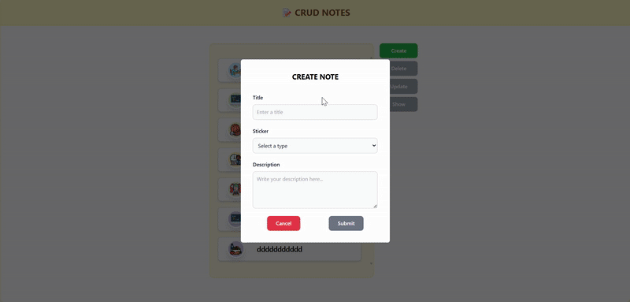
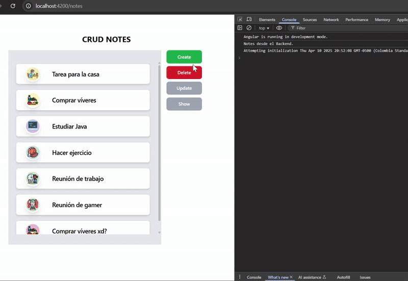
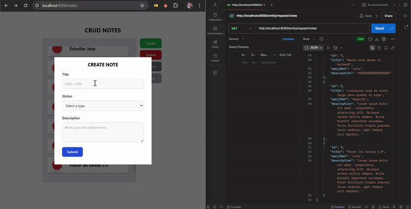

# CRUD Notes

**CRUD Notes** es una aplicación web que permite realizar operaciones CRUD (Crear, Leer, Actualizar, Eliminar) sobre notas, con acceso a base de datos.

## Tecnologías Utilizadas 🚀

- **Angular** 🖥️: Framework principal para el desarrollo frontend.
- **NgRx** 🔄: Librería para la gestión del estado de la aplicación de manera reactiva.
- **SweetAlert2** 🎨: Alertas, confirmaciones muy dinamicas para angular.
- **Tailwind CSS** 🌐: Framework CSS para crear interfaces responsivas y personalizadas rápidamente.
- **Git Flow** 🧑‍💻: Flujo de trabajo de Git para gestión de ramas y colaboraciones.
- **Base de Datos** 💾: (Especificar la base de datos que se utilizará es MYSQL).

### Avances
### Avances

